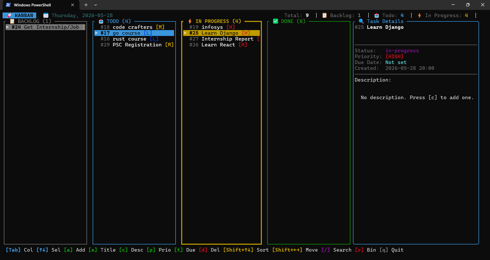

# Kanban

A vibe‑coded, terminal‑first Kanban task app written in Rust. It ships with a CLI for quick edits and a rich TUI for day‑to‑day workflow. Data is stored locally in SQLite.

<div style="text-align: center;">
    
</div>

## Features

- **Four built‑in columns**: `backlog`, `todo`, `in-progress`, `done`
- **CLI** for scripting and quick edits
- **TUI** with:
  - Add/edit tasks and descriptions
  - Priority cycling (Low / Medium / High)
  - Due‑date picker
  - Search and filtering
  - Reorder tasks within a column
  - Move tasks across columns
  - Recycle bin (restore or delete permanently)

## Requirements

- Rust toolchain (edition 2021)

## Install & Build

```bash
cargo build --release
```

## Quick Start

Initialize the database (required once):

```bash
cargo run -- init
```

Add a task:

```bash
cargo run -- add "Write project README"
```

List tasks:

```bash
cargo run -- list
cargo run -- list todo
```

Launch the TUI:

```bash
cargo run -- tui
```

## CLI Commands

```text
kanban init
kanban add <title>
kanban list [column]
kanban move <id> <column>
kanban update <id> <title>
kanban delete <id>
kanban columns
kanban tui
```

### Examples

```bash
# Move task #12 to in-progress
cargo run -- move 12 in-progress

# Update a title
cargo run -- update 12 "Implement due date picker"

# Delete (archive) a task
cargo run -- delete 12
```

## TUI Controls

### Navigation
- `Tab` / `Shift+Tab` or `←` `→` / `h` `l`: switch columns
- `↑` `↓` or `j` `k`: select task

### Actions
- `a`: add task
- `e`: edit title
- `c`: edit description
- `p`: cycle priority
- `t`: edit due date
- `m`: move task to next column
- `Shift+←/→`: move task across columns
- `Shift+↑/↓`: reorder task within column
- `d`: delete (moves to recycle bin)
- `/`: search
- `r`: open recycle bin
- `q`: quit

### Recycle Bin
- `↑` `↓` / `j` `k`: select
- `r` or `Enter`: restore
- `d`: delete permanently
- `Esc`: close

### Due‑Date Picker
- `←` `→` / `h` `l`: day
- `↑` `↓` / `k` `j`: week
- `[` / `]` or `PageUp` / `PageDown`: month
- `t`: today
- `Enter`: save
- `Esc`: cancel

## Data Storage

The app stores data in a local SQLite database. By default, it uses:

- `LOCALAPPDATA\kanban\kanban.db` on Windows
- `HOME\kanban\kanban.db` otherwise

You can override the data directory with:

```bash
KANBAN_DATA_DIR=/path/to/data cargo run -- tui
```

## Development

```bash
cargo run -- tui
```

## License

MIT
